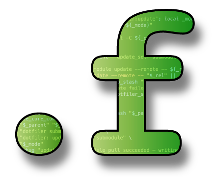

# Dotfiler

Keep your shell, editor, and tool config in sync across every machine you use.

Dotfiler manages a git repository of your dotfiles, unpacking them as symlinks
into your home directory. When you edit `~/.vimrc`, you're editing the file in
your repo — commit and push, and every other machine can pull and instantly get
the update. On a new machine, clone your repo and run one command to recreate
every symlink.

On top of that, dotfiler auto-checks for updates at login and offers to pull
them in — so your dotfiles stay current without you having to think about it.

**Why not GNU Stow?** Stow does the symlink-tree part fine. Dotfiler adds the
auto-update-on-login loop, a modular install system for bootstrapping new
machines (packages, languages, apps), and a GUI for exploring and managing
tracked files. If you just want symlinks, Stow is simpler. If you want a full
dotfile lifecycle — track, sync, install, update — dotfiler has you covered.

> **zdot:** dotfiler integrates with [zdot](https://github.com/georgeharker/zdot),
> a modular zsh configuration manager, but does not require it. See
> [docs/zdot-integration.md](docs/zdot-integration.md) for details.

---

## Documentation

- [Authoring install files](docs/authoring-install-files.md)
- [How updates work](docs/how-updates-work.md) — user perspective, deployment tradeoffs
- [Update hooks](docs/update-hooks.md) — authoring hooks, internals, API reference
- [zdot integration](docs/zdot-integration.md)

---

## Quick Start

```bash
# Clone your dotfiles repo (or create one)
git clone <your-repo> ~/.dotfiles && cd ~/.dotfiles

# Add dotfiler as a git submodule inside the repo
git submodule add https://github.com/georgeharker/dotfiler .nounpack/dotfiler
chmod +x .nounpack/dotfiler/dotfiler

# Copy exclusionn rules
cp ~/.dotfiles/.nounpack/dotfiler/dotfiles_exclude ~/.dotfiles/

# Track some dotfiles and create symlinks
.nounpack/dotfiler/dotfiler setup -i ~/.zshrc ~/.vimrc ~/.gitconfig
.nounpack/dotfiler/dotfiler setup -u

# Enable auto-update on login (add to your .zshrc)
echo '[[ -f ~/.dotfiles/.nounpack/dotfiler/check_update.zsh ]] && source ~/.dotfiles/.nounpack/dotfiler/check_update.zsh' >> ~/.zshrc

# Enable shell completions (optional)
echo 'source ~/.dotfiles/.nounpack/dotfiler/completions.zsh' >> ~/.zshrc
```

---

## Installation

### Option 1: Git Submodule (Recommended)

Keeps dotfiler as a versioned dependency inside your dotfiles repo.

```bash
cd ~/.dotfiles
git submodule add https://github.com/georgeharker/dotfiler .nounpack/dotfiler
chmod +x .nounpack/dotfiler/dotfiler
git commit -m "Add dotfiler as submodule"
```

To update dotfiler later:

```bash
cd ~/.dotfiles/.nounpack/dotfiler
git pull
cd ~/.dotfiles
git add .nounpack/dotfiler
git commit -m "Update dotfiler"
```

On a new machine, after cloning your dotfiles repo:

```bash
git submodule update --init --recursive
```

### Option 2: Git Subtree

Embeds dotfiler's history directly into your dotfiles repo — no submodule
dependency at clone time.

```bash
cd ~/.dotfiles
git remote add dotfiler https://github.com/georgeharker/dotfiler.git
git subtree add --prefix=.nounpack/dotfiler dotfiler main --squash
chmod +x .nounpack/dotfiler/dotfiler
```

To update:

```bash
git subtree pull --prefix=.nounpack/dotfiler dotfiler main --squash
```

**Required:** Tell dotfiler which remote to track for self-updates. Add this
to your `.zshrc` **before** sourcing `check_update.zsh`:

```bash
zstyle ':dotfiler:update' subtree-remote 'dotfiler main'
```

Without this, dotfiler cannot detect that it is installed as a subtree and
will silently skip self-update checks.

### Option 3: Standalone Clone

Simplest option: just clone dotfiler somewhere and point your dotfiles at it.

```bash
git clone https://github.com/georgeharker/dotfiler ~/.dotfiler
chmod +x ~/.dotfiler/dotfiler
```

Then configure your dotfiles repo to find the scripts:

```bash
# In your .zshrc, before sourcing check_update.zsh:
zstyle ':dotfiles:scripts' path "$HOME/.dotfiler"
```

---

## New Machine Setup

Clone your repo and restore all symlinks in one go:

```bash
git clone <your-repo> ~/.dotfiles
cd ~/.dotfiles
git submodule update --init --recursive   # if using submodule
chmod +x .nounpack/dotfiler/dotfiler .nounpack/dotfiler/.zsh
.nounpack/dotfiler/dotfiler setup -u
```

Then optionally bootstrap your full environment:

```bash
.nounpack/dotfiler/dotfiler install
```

---

## Commands

### `dotfiler setup` — Track and link dotfiles

```
dotfiler setup [options]
```

| Flag | Long form | Description |
|------|-----------|-------------|
| `-s` | `--setup` | Auto-ingest dotfiles found under `~/` |
| `-i path …` | `--ingest path …` | Track specific files and create symlinks |
| `-u [file …]` | `--unpack [file …]` | Create/restore symlinks (respects exclusions) |
| `-U [file …]` | `--force-unpack [file …]` | Force-unpack, ignoring exclusions |
| `-t path …` | `--track path …` | Track without creating a symlink |
| `-x path …` | `--untrack path …` | Untrack (remove from repo management) |
| `-d` | `--diff` | Show diff between repo and home |
| `-D` | `--dry-run` | Show what would happen without doing it |
| `-q` | `--quiet` | Suppress non-error output |
| `-y` | `--yes` | Default yes to all prompts |
| `-n` | `--no` | Default no to all prompts |

Examples:

```bash
dotfiler setup -i ~/.zshrc ~/.gitconfig  # Track and link specific files
dotfiler setup -u                        # Restore all symlinks
dotfiler setup -u -D                     # Dry run: show what unpack would do
dotfiler setup -s -y                     # Auto-ingest, answer yes to all prompts
dotfiler setup -x ~/.old-secret          # Stop tracking a file
```

### `dotfiler check-updates` — Check for upstream changes

Usually sourced automatically at login (see [Auto-Update on Login](#auto-update-on-login)),
but can also be run directly:

```
dotfiler check-updates [options]
```

| Flag | Long form | Description |
|------|-----------|-------------|
| `-f` | `--force` | Force check, ignoring the timestamp cache |
| `-v` | `--verbose` | Show progress output |
| `-d` | `--debug` | Show debug tracing (implies --verbose) |

```bash
dotfiler check-updates           # Check against git remote
dotfiler check-updates --force   # Ignore cache, check now
dotfiler check-updates --verbose # Show progress output
dotfiler check-updates --debug   # Show full debug tracing
```

### `dotfiler update` — Pull updates and re-link

```
dotfiler update [options]
```

| Flag | Long form | Description |
|------|-----------|-------------|
| `-q` | `--quiet` | Suppress non-error output |
| `-v` | `--verbose` | Verbose output |
| `-D` | `--dry-run` | Show what would happen without doing it |
| `-c hash` | `--commit-hash hash` | Replay a specific commit (manual use — no `git pull`) |
| `-r range` | `--range range` | Replay an arbitrary revision range (manual use — no `git pull`) |

```bash
dotfiler update                  # Default: fetch → diff pending commits → git pull → re-unpack
dotfiler update -D               # Dry run — print what would change, touch nothing
dotfiler update -c abc1234       # Replay a single commit's file changes into $HOME (no pull)
dotfiler update -r HEAD~3..HEAD  # Replay an arbitrary range's file changes (no pull)
```

**Default mode** (`dotfiler update` with no flags) is the normal upgrade path:
it fetches the tracked remote, computes the diff of all incoming commits, runs
`git pull`, then re-unpacks only the files that changed. Nothing is re-linked
unnecessarily.

**`-c` / `-r` modes** are strictly for manual, surgical use — replaying a
specific commit (or range) into `$HOME` without touching git history. They are
never called by the auto-update machinery.

`--dry-run` suppresses the pull and all filesystem writes in every mode.

Only files that changed in the relevant commits get re-unpacked — fast and safe.
If any `.nounpack/install/.zsh` scripts changed, dotfiler warns you to re-run
`dotfiler install`.

### `dotfiler install` — Bootstrap a new machine

```
dotfiler install [--force]
dotfiler install-module <name> [--force]
```

```bash
dotfiler install                             # Run all install modules in order
dotfiler install --force                     # Reinstall even if already present
dotfiler install-module shell-utils          # Run one module by name
dotfiler install-module shell-utils --force  # Force reinstall one module
```

### `dotfiler gui` — Graphical interface

```bash
pip install -r .nounpack/dotfiler/requirements.txt
dotfiler gui
```

GUI features:
- **Add Mode**: Browse the filesystem and track config files
- **Manage Mode**: View status (linked, broken, conflicted) of tracked files
- **Batch Operations**: Select multiple files for tracking or unlinking

Controls: `↑↓←→` navigate, `Space/Enter` select, `I` track, `F` file info, `Q` quit.

---

## Auto-Update on Login

### Integration

`check_update.zsh` must be **sourced** (not executed) so it can interact with
the current shell — prompt the user, run `zsh` hooks, etc.

Add this to your `.zshrc`, after any `zstyle` configuration:

```bash
[[ -f ~/.dotfiles/.nounpack/dotfiler/check_update.zsh ]] && \
    source ~/.dotfiles/.nounpack/dotfiler/check_update.zsh
```

That's all that's required. On each new login shell, dotfiler checks whether
the remote has new commits, then acts based on your configured mode.

If you're using the standalone install, point to the script directly:

```bash
[[ -f ~/.dotfiler/check_update.zsh ]] && source ~/.dotfiler/check_update.zsh
```

### Update modes

Control the behaviour with `zstyle` (set this **before** the `source` line):

```bash
zstyle ':dotfiler:update' mode 'prompt'      # ask [Y/n] at login — default
zstyle ':dotfiler:update' mode 'auto'        # pull silently, no interaction
zstyle ':dotfiler:update' mode 'background'  # fetch and apply in background subshell
zstyle ':dotfiler:update' mode 'reminder'    # print a reminder only, never update
zstyle ':dotfiler:update' mode 'disabled'    # skip the check entirely
```

| Mode | Behaviour |
|------|-----------|
| `prompt` | Asks `[Y/n]` at login. Default is Y. If you have already typed input when the prompt fires, shows a reminder instead. |
| `auto` | Fetches and applies updates silently in the foreground at login. |
| `background` | Launches the update check and apply in background subshells. The result (success or error) is surfaced on the **next prompt** via a `precmd` hook, so the login shell is never blocked. |
| `reminder` | Prints a message but never pulls. Useful if you prefer manual control. |
| `disabled` | Does nothing. No network activity. |

Oh-My-Zsh users: dotfiler falls back to reading `:omz:update mode` if no
`:dotfiler:update` mode is set. The legacy env vars `DISABLE_UPDATE_PROMPT=true`
(→ `auto`) and `DISABLE_AUTO_UPDATE=true` (→ `disabled`) are still honoured.

### Debugging the update check

To see exactly what `check_update.zsh` is doing at login, enable debug output
in any of these ways:

```bash
# 1. Environment variable — set before opening a shell (e.g. in .zshenv)
export DOTFILER_DEBUG=1    # debug tracing
export DOTFILER_VERBOSE=1  # progress output only

# 2. Flag — when running check-updates directly
dotfiler check-updates --verbose
dotfiler check-updates --debug
```

With `DOTFILER_DEBUG` set, every phase is printed with a `[debug]` prefix so
you can trace exactly which branch is taken, what lock files are acquired, and
whether an update is detected. `DOTFILER_VERBOSE` shows higher-level progress
without the low-level tracing.

### Check frequency

By default, dotfiler checks at most once per hour (3600 seconds). Override with:

```bash
zstyle ':dotfiler:update' frequency 86400   # once per day
zstyle ':dotfiler:update' frequency 3600    # once per hour (default)
```

The timestamp is stored in `${XDG_CACHE_HOME:-$HOME/.cache}/dotfiles/dotfiles_update`.
Delete that file or run `dotfiler check-updates --force` to trigger an immediate check.

### How the check works

1. Attempts a `git fetch` of the tracked remote and branch (silent).
2. Compares local `HEAD` against `remote/branch` — if they differ, updates are available.
3. If `git fetch` fails (e.g. no network): falls back to the GitHub REST API
   (`curl`/`wget`) to compare SHAs.
4. If no network tools are available at all: assumes updates are available (fail-open).

A lock file (`~/.cache/dotfiles/update.lock`) prevents concurrent update runs.
Locks older than 24 hours are automatically removed.

#### Authenticated GitHub API requests

Set `GH_TOKEN` in your environment to use an authenticated request for the
GitHub API fallback (step 3 above). This raises the rate limit from 60 to
5 000 requests per hour and avoids throttling on shared IP addresses:

```bash
export GH_TOKEN=ghp_xxxxxxxxxxxxxxxxxxxx   # in .zshenv or similar
```

#### `background` mode and typed-input fallback

When `mode` is `background`, the update check and apply run in background
subshells so the login shell is never blocked. The result is surfaced on the
**next prompt** via a `precmd` hook.

If you have already typed input into the prompt when the result arrives,
dotfiler will not interrupt you with an interactive `[Y/n]` question. Instead
it falls back to a reminder message (same as `reminder` mode) and lets you
decide when to run `dotfiler update` manually.

### Skipped silently when

- Mode is `disabled`
- The dotfiles directory is not owned or writable by the current user
- Not running in an interactive terminal (`tty` check)
- `git` is not installed
- The dotfiles directory is not a git repo

---

## Modular Install System

Dotfiler includes a numbered module system for bootstrapping a full development
environment on a new machine. Copy the example templates, customise them, then
commit them to your dotfiles repo alongside your config.

```bash
# Copy templates into your dotfiles repo
cp -r .nounpack/dotfiler/example_install/ .nounpack/install/

# Customise as needed
vim .nounpack/install/02-shell-utils.zsh

# Run all modules
dotfiler install

# Or run a single module
dotfiler install-module shell-utils
```

Available modules (in run order):

| Module | Purpose |
|--------|---------|
| `00-dotfiler-install.zsh` | Symlink `dotfiler` command to `~/bin` |
| `01-package-manager.zsh` | Homebrew (macOS) / APT + extras (Linux), fonts |
| `02-shell-utils.zsh` | `eza`, `fzf`, `zoxide`, `antidote`, etc. |
| `03-development-tools.zsh` | `git`, `delta`, `cmake`, and friends |
| `04-editors-terminals.zsh` | `tmux`, `neovim`, terminal emulators |
| `05-programming-languages.zsh` | Language runtimes and version managers |
| `06-applications.zsh` | End-user applications |
| `07-post-install.zsh` | Final configuration and cleanup |

Install scripts are idempotent by default — already-installed items are skipped.
`--force` triggers reinstall (`brew reinstall`, `cargo install -f`, etc.).

See `example_install/README.md` for full documentation of the helper functions
available inside install modules.

---

## Configuration

All configuration is via `zstyle`. Add these to your `.zshrc` before sourcing
`check_update.zsh`:

```bash
# Override the dotfiles repo path (default: auto-detected)
zstyle ':dotfiles:directory' path '/path/to/dotfiles'

# Override the scripts directory (default: .nounpack/dotfiler inside the dotfiles repo)
# Can be an absolute path or relative to ':dotfiles:directory' path
zstyle ':dotfiles:scripts' path '/path/to/scripts'

# Override the install modules directory
# Can be absolute or relative to ':dotfiles:directory' path
zstyle ':dotfiles:install' directory '/path/to/install'

# Override the exclusions file
# Can be absolute or relative to ':dotfiles:directory' path
zstyle ':dotfiles:exclude' path '/path/to/dotfiles_exclude'

# Update behaviour
zstyle ':dotfiler:update' mode 'prompt'   # auto | prompt | background | reminder | disabled
zstyle ':dotfiler:update' frequency 86400 # check interval in seconds

# Subtree remote (required when dotfiler is embedded as a git subtree)
zstyle ':dotfiler:update' subtree-remote 'dotfiler main'

# Hooks directory (optional — for component check-update / update hooks)
zstyle ':dotfiler:hooks' dir "$HOME/.config/dotfiler/hooks"
```

---

## File Exclusions

Dotfiler uses gitignore-style patterns to decide which files to skip during
auto-ingest and unpack. The default exclusion file is `dotfiles_exclude` in
your dotfiles repo root.

```bash
# Copy the example exclusion file into your repo root
cp ~/.dotfiles/.nounpack/dotfiler/dotfiles_exclude ~/.dotfiles/
```

Example patterns:

```
.git/              # Never track version control internals
.nounpack/         # Never track dotfiler itself
dotfiles_exclude   # Never track the exclusion file
node_modules/      # Dependencies
.DS_Store          # macOS metadata
*.swp              # Vim swap files
.vscode/           # IDE state
```

Pattern types:

- **Directory**: ends with `/` — matches the directory and all its contents
- **Path**: contains `/` — matched against the full relative path
- **Name**: no `/` — matched against the filename only
- **Glob**: standard shell wildcards apply

Override the file location:

```bash
zstyle ':dotfiles:exclude' path '/path/to/my-exclusions.txt'
```

---

## Shell Completions

```bash
# Add to .zshrc
source ~/.dotfiles/.nounpack/dotfiler/completions.zsh
```

Provides tab completion for all commands and options:

```bash
dotfiler <TAB>                  # gui, setup, check-updates, update, install, …
dotfiler setup -<TAB>           # -i, -s, -u, -U, -t, -x, -D, … with descriptions
dotfiler setup -i <TAB>         # file completion
dotfiler check-updates --<TAB>  # --force, --debug, --help
```

---

## Directory Structure

```
~/.dotfiles/
├── .nounpack/
│   ├── scripts/           # Dotfiler (submodule, subtree, or symlink)
│   │   ├── dotfiler       # Main command dispatcher
│   │   ├── setup.zsh
│   │   ├── update.zsh
│   │   ├── check_update.zsh
│   │   ├── install.zsh
│   │   ├── helpers.zsh
│   │   ├── completions.zsh
│   │   ├── dotfiles_exclude
│   │   └── example_install/
│   └── install/           # Your customised install modules (committed to repo)
│       ├── 00-dotfiler-install.zsh
│       └── …
├── dotfiles_exclude       # Your exclusion patterns
├── .zshrc                 # Tracked dotfiles (symlinked to ~/)
├── .vimrc
└── .config/
    └── nvim/init.lua
```

---

## Typical Workflows

### Track a new config file

```bash
dotfiler setup -i ~/.config/newsoftware/config.toml
git add -A && git commit -m "Track newsoftware config"
git push
```

### Edit a tracked config

Because tracked files are symlinks, edits go directly into your repo:

```bash
vim ~/.vimrc
cd ~/.dotfiles
git add .vimrc && git commit -m "Update vim config"
git push
```

### Pull updates on another machine

```bash
# Manually:
dotfiler update

# Or just open a new shell — check_update.zsh handles it at login
```

### Restore everything on a new machine

```bash
git clone <your-repo> ~/.dotfiles
cd ~/.dotfiles
git submodule update --init --recursive
chmod +x .nounpack/dotfiler/dotfiler .nounpack/dotfiler/.zsh
.nounpack/dotfiler/dotfiler setup -u
.nounpack/dotfiler/dotfiler install
```

---

## Troubleshooting

```bash
# Scripts not executable after clone
chmod +x ~/.dotfiles/.nounpack/dotfiler/dotfiler ~/.dotfiles/.nounpack/dotfiler/.zsh

# Re-create all symlinks
dotfiler setup -u

# Force update check
dotfiler check-updates --force

# See what setup would do without making changes
dotfiler setup -u -D

# Inspect git state
cd ~/.dotfiles && git status
```
