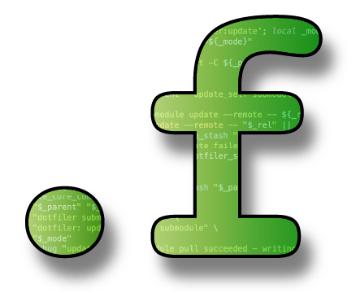

# Dotfiler

Keep your shell, editor, and tool config in sync across every machine you use.

> 📖 Rendered documentation:
> [docs.georgeharker.com/dotfiler](https://docs.georgeharker.com/dotfiler/)
> · [dev](https://docs.georgeharker.com/dotfiler/dev/)

---

- [Why Dotfiler?](#why-dotfiler)
- [Documentation](#documentation)
- [Quick Start](#quick-start)
- [Installation](#installation)
- [New Machine Setup](#new-machine-setup)
- [Day-to-Day](#day-to-day)
- [Updates at Login](#updates-at-login)
- [Modular Install System](#modular-install-system)
- [Shell Completions](#shell-completions)
- [Directory Structure](#directory-structure)
- [Troubleshooting](#troubleshooting)

---

## Why Dotfiler?

Your dotfiles -- `.zshrc`, `.gitconfig`, `nvim/init.lua` -- accumulate over
years. They live in your home directory, scattered and unversioned. When you set
up a new machine, you copy them by hand or write a fragile bootstrap script.
When you improve something on one machine, the others never hear about it.

Dotfiler fixes this with three ideas:

**Git under the hood.** Your dotfiles live in a single git repository
(`~/.dotfiles`). Every change is a commit; every machine gets the same history.
You already know the workflow: edit, commit, push. There is no proprietary
format, no lock-in, no database -- just a git repo you can inspect with any
tool you already know.

**Symlink trees for seamless editing.** Dotfiler replaces your config files
with symlinks that point into the repo. When you edit `~/.vimrc`, you're
editing the file in `~/.dotfiles/.vimrc` -- the change is already staged for
commit. No import/export step, no sync daemon, no copy-on-write tricks. Your
editor, shell, and tools see exactly the same paths they always did.

**Automatic multi-machine updates.** At login, dotfiler checks whether the
remote has new commits. Depending on your configured mode, it can prompt you,
apply silently, or run entirely in the background. Only files that changed in
incoming commits get re-linked -- fast and safe. Third-party components (like
[zdot](https://github.com/georgeharker/zdot)) can register as update hooks to
ride the same update cycle.

### Comparison with alternatives

| | Dotfiler | GNU Stow | chezmoi | yadm |
|-|----------|----------|---------|------|
| Symlink management | Yes | Yes | No (templates) | Yes |
| Auto-update on login | Yes | No | No | No |
| Modular install system | Yes | No | Run scripts | No |
| Component update hooks | Yes | No | No | No |
| GUI | Yes (TUI) | No | No | No |
| Shell completions | Yes | N/A | Yes | Yes |
| Underlying storage | Plain git | Directory tree | Templates + git | git + encryption |

**Why not GNU Stow?** Stow handles the symlink-tree part well. Dotfiler adds
the auto-update-on-login loop, a modular install system for bootstrapping new
machines (packages, languages, apps), a hook system for coordinating component
updates, and a TUI for exploring and managing tracked files. If you just want
symlinks, Stow is simpler. If you want a full dotfile lifecycle -- track, sync,
install, update -- dotfiler has you covered.

### Works great with zdot

Dotfiler pairs naturally with [zdot](https://github.com/georgeharker/zdot), a
modular zsh configuration framework. Store zdot as a git submodule inside your
dotfiles repo and dotfiler will automatically keep it updated alongside your
config files. See [docs/zdot-integration.md](docs/zdot-integration.md) for the
full setup, or the [zdot README](https://github.com/georgeharker/zdot) for a
quickstart that covers both tools together.

## Documentation

| I want to… | Document |
|------------|----------|
| Look up a command or flag | [CLI Reference](docs/commands.md) |
| Configure anything (zstyles, exclusions, env vars) | [Configuration Reference](docs/configuration.md) |
| Understand and tune updates | [How Updates Work](docs/how-updates-work.md) |
| Bootstrap machines with install scripts | [Authoring Install Files](docs/authoring-install-files.md) |
| Hook my own component into updates | [Update Hooks](docs/update-hooks.md) |
| See how updates work under the hood | [Update Internals](docs/update-internals.md) |
| Pair dotfiler with zdot | [zdot Integration](docs/zdot-integration.md) |

## Quick Start

```zsh
# Clone your dotfiles repo (or create one)
git clone <your-repo> ~/.dotfiles && cd ~/.dotfiles

# Add dotfiler as a git submodule inside the repo
git submodule add https://github.com/georgeharker/dotfiler .nounpack/dotfiler
chmod +x .nounpack/dotfiler/dotfiler

# Copy exclusion rules
cp ~/.dotfiles/.nounpack/dotfiler/dotfiles_exclude ~/.dotfiles/

# Track some dotfiles and create symlinks
.nounpack/dotfiler/dotfiler setup -i ~/.zshrc ~/.vimrc ~/.gitconfig
.nounpack/dotfiler/dotfiler setup -u

# Enable auto-update on login (add to your .zshrc)
echo '[[ -f ~/.dotfiles/.nounpack/dotfiler/check_update.zsh ]] && source ~/.dotfiles/.nounpack/dotfiler/check_update.zsh' >> ~/.zshrc

# Enable shell completions (optional)
echo 'source ~/.dotfiles/.nounpack/dotfiler/completions.zsh' >> ~/.zshrc
```

## Installation

### Option 1: Git Submodule (Recommended)

Keeps dotfiler as a versioned dependency inside your dotfiles repo.

```zsh
cd ~/.dotfiles
git submodule add https://github.com/georgeharker/dotfiler .nounpack/dotfiler
chmod +x .nounpack/dotfiler/dotfiler
git commit -m "Add dotfiler as submodule"
```

On a new machine, after cloning your dotfiles repo:

```zsh
git submodule update --init --recursive
```

(Updating dotfiler itself is automatic once update mode is enabled — or run
`dotfiler update-self`.)

### Option 2: Git Subtree

Embeds dotfiler's history directly into your dotfiles repo — no submodule
dependency at clone time.

```zsh
cd ~/.dotfiles
git remote add dotfiler https://github.com/georgeharker/dotfiler.git
git subtree add --prefix=.nounpack/dotfiler dotfiler main --squash
chmod +x .nounpack/dotfiler/dotfiler
```

Self-update defaults to a remote named `dotfiler` pointing at the canonical
repo, with the branch resolved through the normal chain (so
`zstyle ':dotfiler:update' branch dev` works). Override only for a custom
remote name or fork:

```zsh
zstyle ':dotfiler:update' subtree-remote 'dotfiler'
zstyle ':dotfiler:update' subtree-url   'https://github.com/you/dotfiler.git'
```

Prefer the single-word form — `'<remote> <branch>'` hard-pins the branch and
bypasses the `branch` zstyle entirely. See
[Configuration](docs/configuration.md#updates--dotfilerupdate).

### Option 3: Standalone Clone

```zsh
git clone https://github.com/georgeharker/dotfiler ~/.dotfiler
chmod +x ~/.dotfiler/dotfiler
```

Then point your dotfiles at it — in your `.zshrc`, before sourcing
`check_update.zsh`:

```zsh
zstyle ':dotfiles:scripts' path "$HOME/.dotfiler"
```

## New Machine Setup

Clone your repo and restore all symlinks in one go:

```zsh
git clone <your-repo> ~/.dotfiles
cd ~/.dotfiles
git submodule update --init --recursive   # if using submodule
.nounpack/dotfiler/dotfiler setup -u
```

Then optionally bootstrap your full environment:

```zsh
.nounpack/dotfiler/dotfiler install
```

(With registered hook components like zdot, use
`dotfiler setup --bootstrap` instead of `setup -u` — see
[zdot Integration](docs/zdot-integration.md#bootstrap-new-machine).)

## Day-to-Day

```zsh
# Track a new config file
dotfiler setup -i ~/.config/newsoftware/config.toml
dotfiler commit -m "Track newsoftware config" && dotfiler push

# Edit a tracked config — symlinks mean it's already in the repo
vim ~/.vimrc
dotfiler add .vimrc && dotfiler commit -m "Update vim config" && dotfiler push

# Pull updates on another machine (or just open a new shell)
dotfiler update

# See repo state
dotfiler status --fetch
```

The full command set — `setup` flags, `update` flags, the git wrappers, the
TUI — is in the [CLI Reference](docs/commands.md).

## Updates at Login

Source `check_update.zsh` from your `.zshrc` (Quick Start above) and pick a
mode:

```zsh
zstyle ':dotfiler:update' mode 'prompt'      # ask [Y/n] at login — default
zstyle ':dotfiler:update' mode 'auto'        # pull silently
zstyle ':dotfiler:update' mode 'background'  # never block the prompt
zstyle ':dotfiler:update' mode 'reminder'    # print a nudge, never pull
zstyle ':dotfiler:update' mode 'disabled'    # no checks
```

Frequency, release channels (updates only on tagged releases by default),
branch overrides, and the mechanics of the check are covered in
[How Updates Work](docs/how-updates-work.md).

## Modular Install System

Numbered zsh modules bootstrap a full development environment on a new
machine. Copy the templates, customise, commit them alongside your config:

```zsh
cp -r .nounpack/dotfiler/example_install/ .nounpack/install/
vim .nounpack/install/02-shell-utils.zsh
dotfiler install                       # run all modules
dotfiler install-module shell-utils    # or just one
```

The shipped example covers (in run order): dotfiler bootstrap, package
manager + fonts, shell utils, development tools, editors/terminals, editor
extras, programming languages, AI tools, applications, and post-install —
`00-dotfiler-install.zsh` through `09-post-install.zsh`. Install scripts are
idempotent; `--force` re-installs, and profiles (`INSTALL_PROFILE=work`)
let one script set serve different machines.

Writing your own modules: [Authoring Install Files](docs/authoring-install-files.md).
The helper library reference lives with the example:
[example_install/README.md](example_install/README.md).

## Shell Completions

```zsh
# Add to .zshrc
source ~/.dotfiles/.nounpack/dotfiler/completions.zsh
```

Provides tab completion for all commands, flags, component names, and
install-module names.

## Directory Structure

```
~/.dotfiles/
├── .nounpack/
│   ├── dotfiler/          # Dotfiler (submodule, subtree, or standalone elsewhere)
│   │   ├── dotfiler       # Main command dispatcher
│   │   ├── setup.zsh / update.zsh / check_update.zsh / install.zsh
│   │   ├── completions.zsh
│   │   ├── dotfiles_exclude
│   │   └── example_install/
│   └── install/           # Your customised install modules (committed)
├── dotfiles_exclude       # Your exclusion patterns
├── .zshrc                 # Tracked dotfiles (symlinked into ~/)
├── .vimrc
└── .config/
    └── nvim/init.lua
```

Nothing under `.nounpack/` is ever symlinked into `$HOME`.

## Troubleshooting

```zsh
# Scripts not executable after clone
chmod +x ~/.dotfiles/.nounpack/dotfiler/dotfiler

# Re-create all symlinks
dotfiler setup -u

# Force an update check / see what an update would do
dotfiler check-updates --force
dotfiler update -D

# Trace the login check
dotfiler check-updates --debug
```

More: [How Updates Work → Debugging the login check](docs/how-updates-work.md#debugging-the-login-check).

## Acknowledgements

Linting throughout this codebase is checked with [shuck](https://github.com/ewhauser/shuck) — a fast shell linter with first-class zsh support. Thanks to the shuck project for catching the bugs that bash-targeted linters miss.
